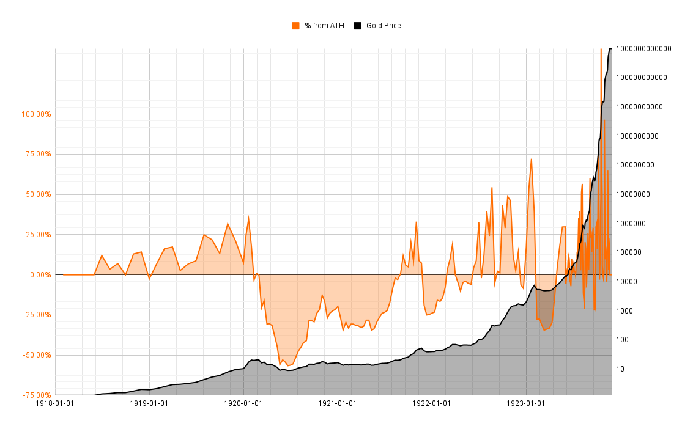

# Weimar Inflation Data

This data represents the exchange rate between the German Mark and gold during the period of hyperinflation in the Weimer Republic (1918-1923).

Note that the reporting interval becomes smaller as the inflation picks up. Also, there are numerous missing dates in the reporting.

# Source

This data is a digitized version of the data found in *Deutsches Reichsgesetzblatt Teil I (1925) p133-135* made available by the Austrian National Library here: https://alex.onb.ac.at/cgi-content/alex?aid=dra&datum=1925&page=185&size=45

